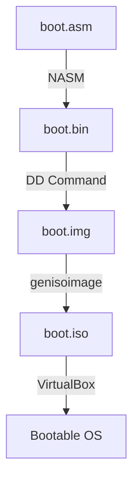

# Simple Bootloader Project

## Project Structure
```
.
├── boot.asm    # Main bootloader assembly code
├── Makefile    # Build automation script
└── README.md   # Project documentation
```

## Flow Diagram


## Component Explanation

### 1. Assembly Code (boot.asm)

#### Key Components:
- `org 0x7C00`: Sets the origin to 0x7C00
  - BIOS loads bootloader at this memory address by convention
  - All memory references are offset from this address

- `bits 16`: Sets 16-bit mode
  - BIOS starts in "Real Mode" which is 16-bit
  - Required for BIOS interrupt calls

- Segment Setup:
  ```nasm
  xor ax, ax
  mov ds, ax
  mov es, ax
  mov ss, ax
  ```
  - Initializes data (ds), extra (es), and stack (ss) segments to 0
  - Ensures consistent memory addressing

- `int 0x10`: BIOS video interrupt
  - Used for displaying characters on screen
  - AH=0x0E: Teletype output function

- Boot Signature (0xAA55)
  - Required by BIOS to identify bootable media
  - Must be at bytes 511-512 of boot sector

### 2. Build Process

#### Makefile Targets:
1. **boot.bin**
   - Raw binary compilation of assembly code
   - Direct machine code output

2. **boot.img**
   - 1.44MB floppy disk image
   - Created using `dd` command
   - First sector contains bootloader

3. **boot.iso**
   - CD-ROM ISO image
   - Created using `genisoimage`
   - Bootable in modern virtual machines

### 3. Commands Explained

#### NASM Command:
```bash
nasm -f bin boot.asm -o boot.bin
```
- `-f bin`: Outputs raw binary format
- No linking needed, pure machine code

#### DD Command:
```bash
dd if=/dev/zero of=boot.img bs=1024 count=1440
```
- Creates empty 1.44MB floppy image
- `bs=1024`: Block size of 1KB
- `count=1440`: 1440 blocks = 1.44MB

#### Genisoimage:
```bash
genisoimage -o boot.iso -b boot.img -hide boot.img iso/
```
- Creates bootable ISO
- `-b`: Specifies boot image
- `-hide`: Hides boot image in ISO filesystem

## Usage Instructions

1. **Building the Project**
   ```bash
   make        # Builds all targets
   make clean  # Removes generated files
   ```

2. **VirtualBox Setup**
   1. Create new VM
      - Type: Other
      - Version: Other/Unknown
      - Memory: 64MB minimum
   
   2. Configure Boot Media
      - Attach boot.iso as CD-ROM
      - Or boot.img as Floppy Disk

3. **Running**
   - Start VM
   - Should display "Hello, OS World!"

## Technical Details

### Memory Layout
```
0x0000 - 0x7BFF: Reserved for BIOS/Hardware
0x7C00 - 0x7DFF: Our Bootloader (512 bytes)
0x7E00 - 0x9FFFF: Available RAM
```

### Boot Process
1. BIOS POST (Power-On Self Test)
2. BIOS loads first sector (512 bytes)
3. Checks for 0xAA55 signature
4. If valid, jumps to 0x7C00
5. Our code executes

## Debugging Tips
- Use QEMU for quick testing:
  ```bash
  qemu-system-x86_64 boot.bin
  ```
- Check boot signature with:
  ```bash
  hexdump -C boot.bin | tail -n 1
  ```