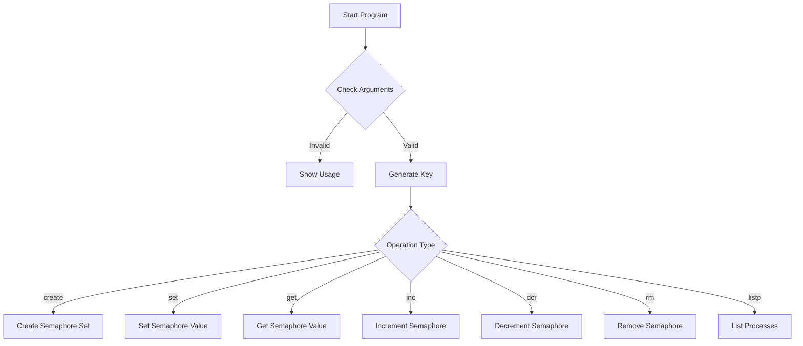
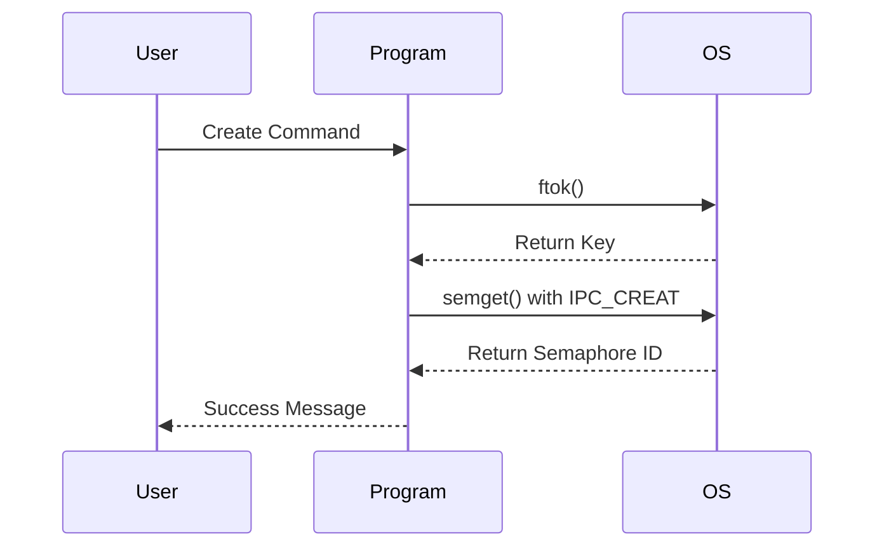
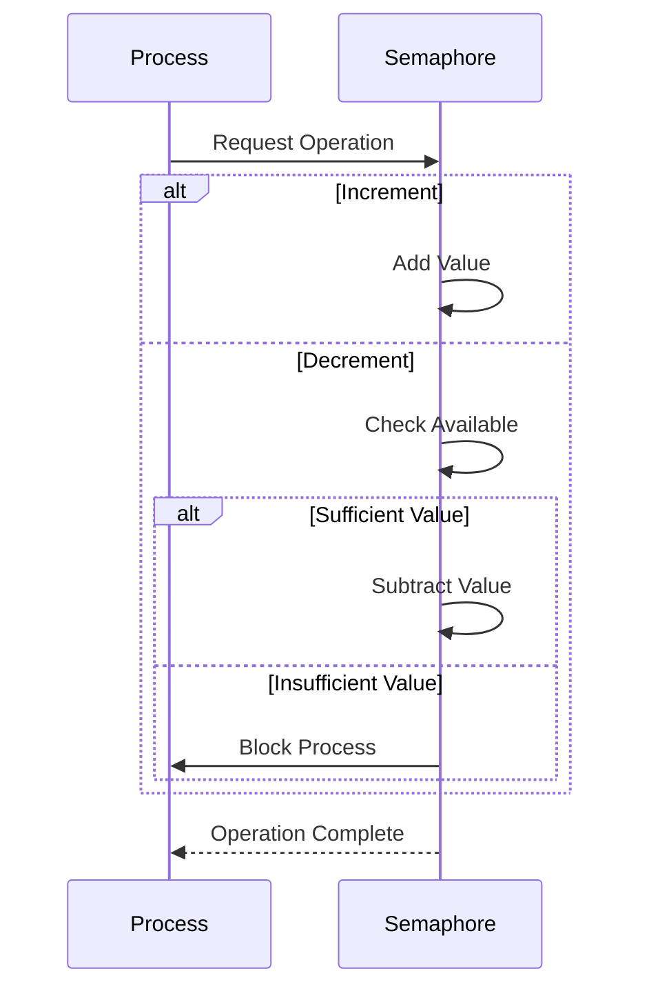

# Semaphore Operations Demo Program

This program demonstrates various operations on System V semaphores in Linux. It provides a command-line interface to create, manipulate, and manage semaphores for inter-process synchronization.

## Table of Contents
- [Overview](#overview)
- [Features](#features)
- [Program Flow](#program-flow)
- [Usage](#usage)
- [Operations](#operations)
- [Visual Representations](#visual-representations)

## Overview

The program implements a comprehensive interface for System V semaphore operations, allowing users to:
- Create semaphore sets
- Set and get semaphore values
- Increment and decrement semaphores
- Remove semaphore sets
- List processes waiting on semaphores

## Features

- **Flexible Key Generation**: Uses `ftok()` to generate unique IPC keys
- **Multiple Operations**: Supports various semaphore operations through command-line arguments
- **Error Handling**: Comprehensive error checking and reporting
- **Process Information**: Ability to view processes waiting on semaphores

## Program Flow



## Usage

```bash
# Create a semaphore set
./semDemo <file_name> <project_id> create <semnum>

# Set semaphore value
./semDemo <file_name> <project_id> set <semnum> <sem_val>

# Get semaphore value
./semDemo <file_name> <project_id> get <semnum>

# Increment semaphore
./semDemo <file_name> <project_id> inc <semnum> <val>

# Decrement semaphore
./semDemo <file_name> <project_id> dcr <semnum> <val>

# Remove semaphore set
./semDemo <file_name> <project_id> rm

# List waiting processes
./semDemo <file_name> <project_id> listp <semnum>
```

## Operations

### Semaphore Creation Process



### Semaphore Operation Process



## Implementation Details

### Key Data Structures

1. **Union semun**: Used for semaphore control operations
```c
union semun {
    int val;                  // Value for SETVAL
    struct semid_ds *buf;     // Buffer for IPC_STAT & IPC_SET
    unsigned short *array;    // Array for GETALL & SETALL
    struct seminfo *__buf;    // Buffer for IPC_INFO
};
```

### Error Handling

The program includes comprehensive error handling for:
- Invalid arguments
- Semaphore creation failures
- Operation failures
- Permission issues

## Common Use Cases

1. **Resource Management**
   - Controlling access to shared resources
   - Managing concurrent process access

2. **Synchronization**
   - Process coordination
   - Critical section protection

3. **Producer-Consumer Problems**
   - Buffer management
   - Flow control

## Best Practices

1. Always remove semaphores when no longer needed
2. Use appropriate error checking
3. Handle semaphore operations atomically
4. Avoid deadlocks by careful operation ordering

## Notes

- The program uses 1-based indexing for semaphore numbers in user interface
- Internal operations convert to 0-based indexing
- All operations are atomic and thread-safe
- Proper permissions are required for semaphore operations 