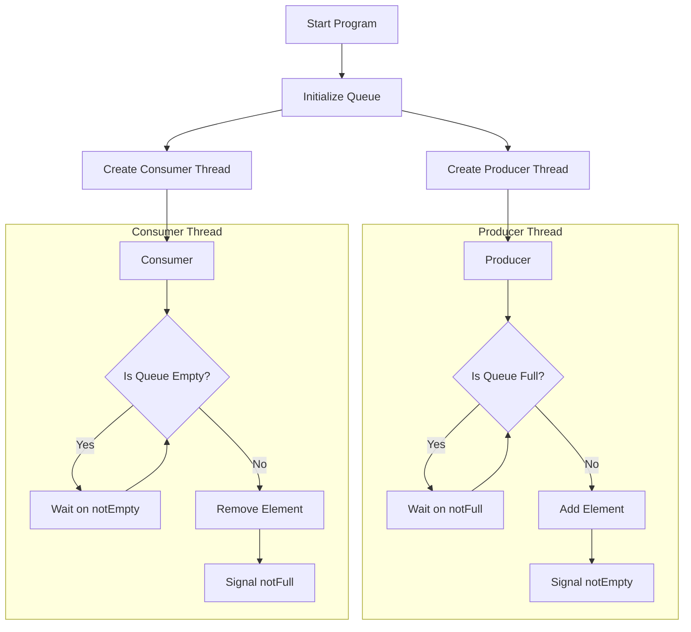
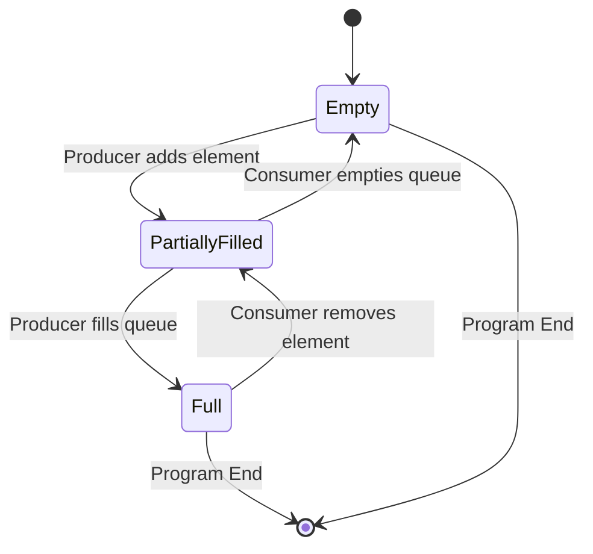

# Circular Queue Implementation with Multiple Threads

This program demonstrates the implementation of a thread-safe circular queue data structure using POSIX threads (pthreads) in C. The implementation showcases producer-consumer synchronization using mutex locks and condition variables.

## Overview

The program implements a circular queue with the following key features:
- Fixed-size circular buffer (size: 5 elements)
- Thread-safe operations using mutex locks
- Producer-Consumer synchronization using condition variables
- Prevents queue overflow and underflow conditions

## Program Structure

### Key Components

1. **Queue Structure**
   - Fixed-size array for data storage
   - Front and rear pointers
   - Mutex lock for thread safety
   - Condition variables for synchronization

2. **Main Operations**
   - `initQueue`: Initializes the queue and synchronization primitives
   - `enqueue`: Adds elements to the queue (Producer operation)
   - `dequeue`: Removes elements from the queue (Consumer operation)

3. **Threads**
   - Producer thread: Generates and adds data to the queue
   - Consumer thread: Retrieves and processes data from the queue

## Flow Diagram



## Synchronization Mechanism

1. **Mutex Lock (`pthread_mutex_t`)**
   - Ensures mutual exclusion for queue operations
   - Prevents simultaneous access to shared resources

2. **Condition Variables**
   - `notEmpty`: Signals when queue has elements
   - `notFull`: Signals when queue has space

## How It Works

1. **Initialization**
   - Queue is created with size 5
   - Mutex and condition variables are initialized
   - Front and rear pointers set to 0

2. **Producer Process**
   - Attempts to add elements to queue
   - If queue is full, waits on `notFull` condition
   - After adding element, signals `notEmpty`

3. **Consumer Process**
   - Attempts to remove elements from queue
   - If queue is empty, waits on `notEmpty` condition
   - After removing element, signals `notFull`

## Queue States



## Compilation and Execution

```bash
gcc -o circular_queue circularQueueThread.c -pthread
./circular_queue
```

## Output Example

The program will show the producer adding numbers 0-9 and the consumer consuming them:

```
Produced: 0
Consumed: 0
Produced: 1
Produced: 2
Consumed: 1
...
```

## Important Notes

1. The queue size is fixed at 5 elements (QUEUE_SIZE)
2. Producer sleeps for 1 second between productions
3. Consumer sleeps for 2 seconds between consumptions
4. Both threads process 10 elements each before terminating

## Error Handling

The implementation includes:
- Prevention of queue overflow
- Prevention of queue underflow
- Thread-safe operations
- Proper synchronization between producer and consumer 