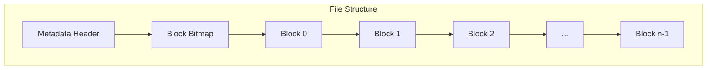
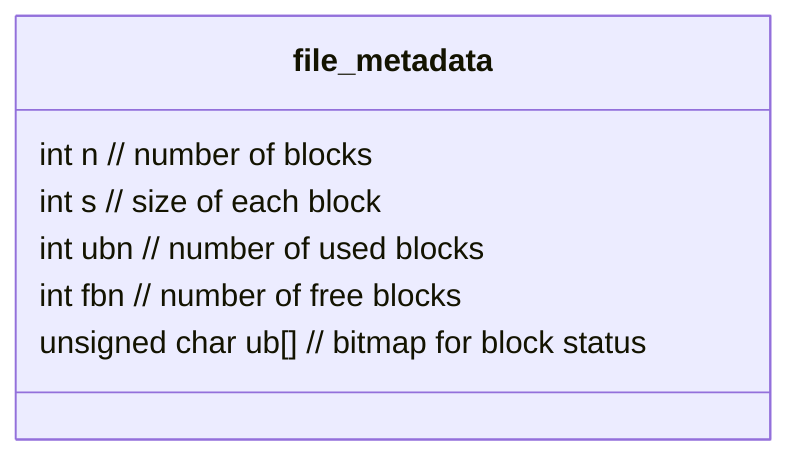
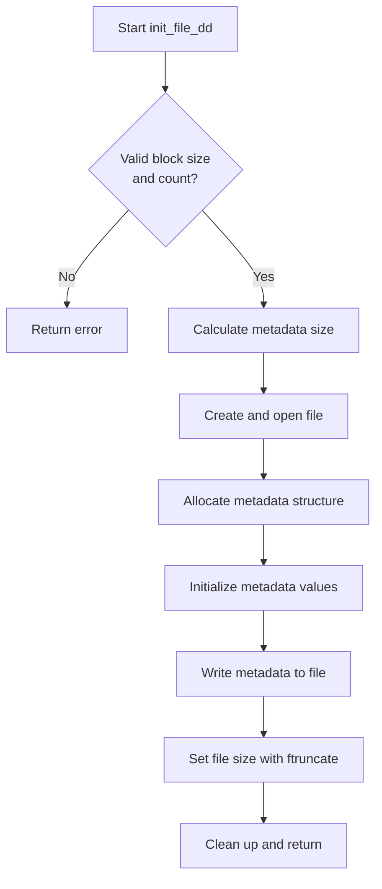
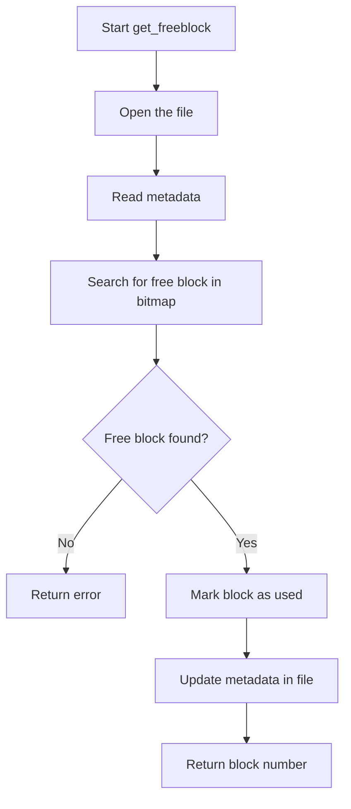
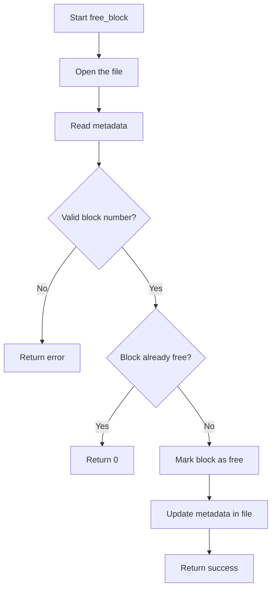
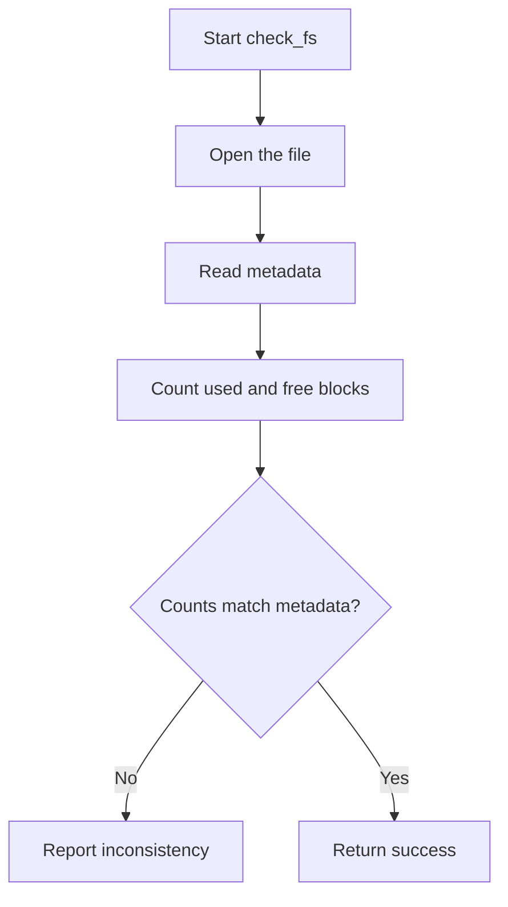
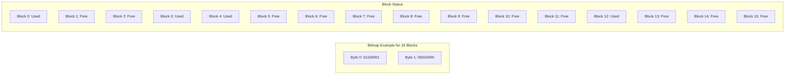

## Overview

This code implements a simple block-based file system management within a single file. It manages allocation and deallocation of fixed-size blocks using a bitmap allocation technique.

## File Structure Visualization



## Key Data Structures

### File Metadata Structure



## Line by Line Explanation

### Header Files and Function Prototypes

```c
#include <stdio.h>
#include <stdlib.h>
#include <string.h>
#include <unistd.h>
#include <fcntl.h>
#include <sys/types.h>
#include <sys/stat.h>
```

These headers provide:
- Standard I/O operations
- Memory allocation functions
- String manipulation functions
- POSIX file operations (open, read, write, lseek)
- File control operations and constants
- System types and file status structures

```c
// Function prototypes
int init_file_dd(const char *fname, int bsize, int bno);
int get_freeblock(const char *fname);
int free_block(const char *fname, int bno);
int check_fs(const char *fname);
void demonstrate_functions(const char *fname);
```
Function declarations for the file system operations.

### Metadata Structure

```c
typedef struct {
    int n;      // number of blocks
    int s;      // size of each block
    int ubn;    // number of used blocks
    int fbn;    // number of free blocks
    unsigned char ub[]; // bitmap for block status (1 bit per block)
} file_metadata;
```

This structure defines how metadata is stored at the beginning of the file:
- `n` and `s` define the total capacity (n blocks of s bytes each)
- `ubn` and `fbn` track used/free block counts
- `ub[]` is a flexible array member that stores a bitmap where each bit represents one block (1=used, 0=free)

### Helper Functions for Metadata

```c
int get_metadata_size(int n) {
    // Calculate how many bytes we need for the bitmap
    // Each byte can store 8 blocks' status
    int bitmap_bytes = (n + 7) / 8;
    return sizeof(file_metadata) + bitmap_bytes;
}
```

This function calculates the total size needed for metadata by:
1. Computing how many bytes are needed for the bitmap (n blocks ÷ 8 bits per byte, rounded up)
2. Adding the base size of the metadata structure

```c
file_metadata* read_metadata(int fd, int n) {
    int meta_size = get_metadata_size(n);
    file_metadata* metadata = (file_metadata*)malloc(meta_size);
    
    if (!metadata) {
        perror("Memory allocation failed");
        return NULL;
    }
    
    lseek(fd, 0, SEEK_SET);
    if (read(fd, metadata, meta_size) != meta_size) {
        perror("Failed to read metadata");
        free(metadata);
        return NULL;
    }
    
    return metadata;
}
```

This function:
1. Allocates memory for the metadata structure including the bitmap
2. Uses `lseek()` to position file pointer at beginning of file (OS concept: file positioning)
3. Reads metadata from file using `read()` system call
4. Handles error conditions with proper cleanup

```c
int write_metadata(int fd, file_metadata* metadata, int n) {
    int meta_size = get_metadata_size(n);
    
    lseek(fd, 0, SEEK_SET);
    if (write(fd, metadata, meta_size) != meta_size) {
        perror("Failed to write metadata");
        return -1;
    }
    
    return 0;
}
```

This function persists metadata to disk:
1. Positions file pointer at beginning of file
2. Writes metadata structure using `write()` system call
3. Returns status code indicating success or failure

### Bitmap Operations

```c
int is_block_free(file_metadata* metadata, int block_num) {
    int byte_idx = block_num / 8;
    int bit_idx = block_num % 8;
    
    // A 0 bit indicates the block is free
    return !(metadata->ub[byte_idx] & (1 << bit_idx));
}
```

This function checks if a specific block is free:
1. Calculates which byte in the bitmap contains the bit for this block
2. Determines which bit position within that byte
3. Uses bitwise operations to check if that bit is set (1=used) or unset (0=free)

```c
void set_block_used(file_metadata* metadata, int block_num) {
    int byte_idx = block_num / 8;
    int bit_idx = block_num % 8;
    
    // Set the bit to 1 (used)
    metadata->ub[byte_idx] |= (1 << bit_idx);
    metadata->ubn++;
    metadata->fbn--;
}
```

This function marks a block as used:
1. Locates the specific bit in the bitmap
2. Uses bitwise OR to set that bit to 1
3. Updates the block counters

```c
void set_block_free(file_metadata* metadata, int block_num) {
    int byte_idx = block_num / 8;
    int bit_idx = block_num % 8;
    
    // Set the bit to 0 (free)
    metadata->ub[byte_idx] &= ~(1 << bit_idx);
    metadata->ubn--;
    metadata->fbn++;
}
```

This function marks a block as free:
1. Locates the specific bit in the bitmap
2. Uses bitwise AND with complement to clear that bit to 0
3. Updates the block counters

## Main Operations

### File Initialization



The `init_file_dd()` function initializes a new file with the specified block parameters:
1. Validates input parameters
2. Calculates total file size needed
3. Creates a new file using `open()` with O_CREAT flag
4. Initializes metadata structure with block counts and sizes
5. Writes metadata to file header
6. Extends file to required size using `ftruncate()` (OS concept: file size manipulation)
7. All blocks start as free (bitmap initialized to zeros by calloc)

### Getting a Free Block



The `get_freeblock()` function allocates a free block:
1. Opens the file for read/write access
2. Reads metadata including bitmap
3. Searches bitmap for first free block (bit=0)
4. Marks selected block as used in bitmap
5. Updates metadata on disk
6. Returns the allocated block number

### Freeing a Block



The `free_block()` function releases a previously allocated block:
1. Opens the file for read/write
2. Verifies block number is valid
3. Checks if block is already free
4. Marks block as free in bitmap
5. Updates metadata on disk
6. Returns status code

### Checking File System Integrity



The `check_fs()` function verifies file system integrity:
1. Reads metadata and bitmap
2. Counts used and free blocks by examining bitmap
3. Compares counts with stored metadata values
4. Reports any inconsistencies
5. This implements a simple file system verification mechanism

### Demonstration Function

The `demonstrate_functions()` function showcases the file system operations:
1. Initializes a file with 2048 blocks of 4096 bytes each
2. Verifies file system integrity
3. Allocates 5 blocks
4. Frees 3 of those blocks
5. Verifies integrity again after operations

## Main Function

The `main()` function creates a file named "dd1" and runs the demonstration.

## OS Concepts Demonstrated

1. **Block-based Storage**: The fundamental concept of most file systems, where storage is divided into fixed-size blocks.

2. **Bitmap Allocation**: Using a bitmap for free space management, a common technique in file systems like ext2/ext3/ext4.

3. **File Descriptors**: Using low-level file descriptor functions (open, read, write, lseek) for file manipulation.

4. **Data Structures in File Systems**: Storing metadata at the beginning of the file, similar to how real file systems store superblocks.

5. **Resource Management**: Proper allocation and deallocation of blocks, with integrity checking.

6. **Error Handling**: Proper error detection and reporting for system calls.

### Bitmap Usage Visualization



This code provides a simple yet effective implementation of block management techniques used in modern file systems but on a smaller scale within a single file.