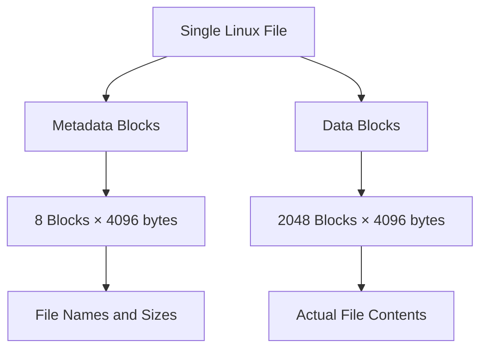
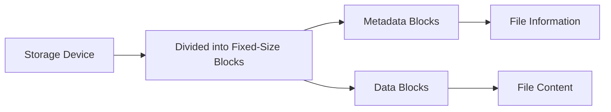
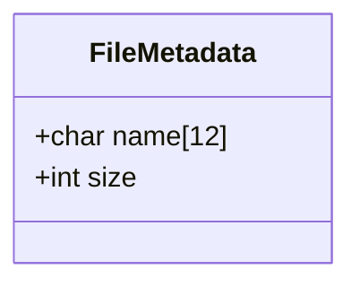
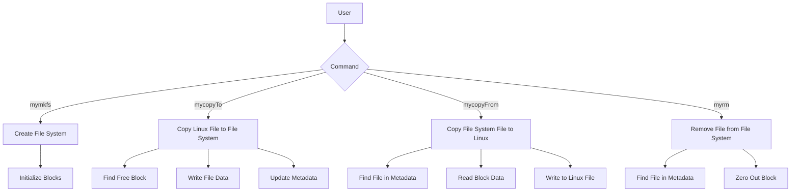

# Custom File System Implementation (myfs)

This document provides a detailed explanation of the custom file system implementation in `myfs.c`. The implementation creates a simple file system that stores multiple files within a single Linux file.

## Table of Contents
- [Conceptual Overview](#conceptual-overview)
- [File System Structure](#file-system-structure)
- [Key OS Concepts](#key-os-concepts)
- [Code Explanation](#code-explanation)
- [Usage Examples](#usage-examples)

## Conceptual Overview

This implementation creates a rudimentary file system stored within a single Linux file. It divides the storage into metadata blocks and data blocks, enabling basic file operations like creation, reading, writing, and deletion.

## File System Structure

The file system is structured as follows:



The first 8 blocks (32KB) store metadata information, and the remaining 2048 blocks (8MB) store the actual file contents.

## Key OS Concepts

### Block-Based Storage



Block-based storage is a fundamental concept in operating systems where storage devices are accessed in fixed-size chunks (blocks) rather than byte-by-byte. This implementation uses a block size of 4096 bytes, which is common in modern file systems.

### File Metadata



File metadata contains essential information about files, including:
- Name (limited to 12 bytes)
- Size (4 bytes to store file size)

### File System Operations



## Code Explanation

### Header Inclusions and Constants

```c
#include <stdio.h>
#include <stdlib.h>
#include <string.h>
#include <unistd.h>
#include <fcntl.h>
#include <sys/types.h>
#include <sys/stat.h>
```

These header files provide essential functions and definitions:
- `stdio.h`: Standard I/O operations
- `stdlib.h`: Memory allocation, process control
- `string.h`: String manipulation functions
- `unistd.h`: POSIX API functions like read/write
- `fcntl.h`: File control options
- `sys/types.h` and `sys/stat.h`: System data types and file status

```c
# define METADATA_BLOCK 8
#define DATA_BLOCK 2048 
#define BLOCK_SIZE 4096
#define MAX_FILE_NAME 12
#define FILE_SIZE 4
```

These constants define the structure of our file system:
- The first 8 blocks are reserved for metadata
- 2048 blocks are available for file data
- Each block is 4096 bytes (common OS page size)
- Filenames are limited to 12 bytes
- File size value uses 4 bytes (int)

### File Metadata Structure

```c
struct file_metadata {
    char name[MAX_FILE_NAME]; /*File name*/
    int size; /*Size of file*/
} FileMetadata;
```

This structure defines how file metadata is stored:
- `name`: Character array storing the filename (12 bytes)
- `size`: Integer storing the file size (4 bytes)

### Block Operations

```c
int read_block(int fd, int block_num, char *buffer) {
    lseek(fd, block_num * BLOCK_SIZE, SEEK_SET);
    return read(fd, buffer, BLOCK_SIZE);
}

int write_block(int fd, int block_num, char *buffer) {
    lseek(fd, block_num * BLOCK_SIZE, SEEK_SET);
    return write(fd, buffer, BLOCK_SIZE);
}
```

These functions abstract the reading and writing of blocks:
- `read_block`: Seeks to a specific block and reads its contents into the buffer
- `write_block`: Seeks to a specific block and writes buffer contents to it
- Both use `lseek` to position the file descriptor at the correct offset

### File System Creation

```c
int create_filesystem(char *filename) {
    int fd = open(filename, O_RDWR | O_CREAT | O_TRUNC, 0666);
    if (fd < 0) {
        perror("Error creating filesystem");
        return -1;
    }
    char buffer[BLOCK_SIZE] = {0};
    for (int i = 0; i < METADATA_BLOCK + DATA_BLOCK; i++) {
        write_block(fd, i, buffer);
    }
    close(fd);
    return 0;
}
```

This function creates a new file system:
1. Opens/creates a file with read/write permissions
2. Initializes a buffer with zeros
3. Writes zeros to all blocks (metadata + data)
4. Returns 0 on success, -1 on failure

### Finding Free Blocks

```c
int get_free_block(char *filename) {
    int fd = open(filename, O_RDWR);
    if (fd < 0) {
        perror("Error opening filesystem");
        return -1;
    }
    char buffer[BLOCK_SIZE];
    for (int i = 0; i < DATA_BLOCK; i++) {
        read_block(fd, METADATA_BLOCK + i, buffer);
        if (buffer[0] == '\0') { // Check if the block is free
            close(fd);
            return METADATA_BLOCK + i;
        }
    }
    close(fd);
    return -1; // No free block found
}
```

This function searches for an available data block:
1. Opens the file system
2. Reads each data block
3. Returns the first block index that starts with a null character (empty)
4. Returns -1 if no free blocks are found

### Metadata Operations

```c
int write_metadata(char *filename, int block_num, char *name, int size) {
    int fd = open(filename, O_RDWR);
    if (fd < 0) {
        perror("Error opening filesystem");
        return -1;
    }
    char buffer[BLOCK_SIZE];
    lseek(fd, block_num * BLOCK_SIZE, SEEK_SET);
    struct file_metadata metadata;
    strncpy(metadata.name, name, MAX_FILE_NAME);
    metadata.size = size;
    memcpy(buffer, &metadata, sizeof(struct file_metadata));
    write(fd, buffer, sizeof(struct file_metadata));
    close(fd);
    return 0;
}

int read_metadata(char *filename, int block_num, struct file_metadata *metadata) {
    int fd = open(filename, O_RDONLY); 
    if (fd < 0) {
        perror("Error opening filesystem");
        return -1;
    } 
    char buffer[BLOCK_SIZE];
    lseek(fd, block_num * BLOCK_SIZE, SEEK_SET);
    read(fd, buffer, sizeof(struct file_metadata));
    memcpy(metadata, buffer, sizeof(struct file_metadata));
    close(fd);
    return 0;
}
```

These functions handle metadata manipulation:
- `write_metadata`: Writes file name and size to a specific block
- `read_metadata`: Reads metadata from a specific block into a struct

### File System Operations

#### Creating a File System

```c
void mymkfs(char *filename) {
    if (create_filesystem(filename) == 0) {
        printf("Filesystem %s created successfully.\n", filename);
    } else {
        printf("Failed to create filesystem %s.\n", filename);
    }
}
```

This function creates a new file system by calling `create_filesystem()`.

#### Copying Files to the File System

```c
void myCopyTo(char *filename, char *linux_file) {
    int fd = open(filename, O_RDWR);
    if (fd < 0) {
        perror("Error opening filesystem");
        return;
    }
    int block_num = get_free_block(filename);
    if (block_num < 0) {
        printf("No free block available in filesystem.\n");
        close(fd);
        return;
    }
    int linux_fd = open(linux_file, O_RDONLY);
    if (linux_fd < 0) {
        perror("Error opening Linux file");
        close(fd);
        return;
    }
    char buffer[BLOCK_SIZE];
    struct file_metadata metadata;
    read_metadata(filename, block_num, &metadata);
    int bytes_read = read(linux_fd, buffer, BLOCK_SIZE);
    if (bytes_read < 0) {
        perror("Error reading Linux file");
        close(linux_fd);
        close(fd);
        return;
    }
    write_block(fd, block_num, buffer);
    metadata.size = bytes_read;
    strncpy(metadata.name, linux_file, MAX_FILE_NAME);
    write_metadata(filename, block_num, metadata.name, metadata.size);
    printf("File %s copied to filesystem %s at block %d.\n", linux_file, filename, block_num);
    close(linux_fd);
    close(fd);
}
```

This function copies a Linux file into the file system:
1. Opens the file system
2. Finds a free block
3. Opens the source Linux file
4. Reads the Linux file contents (up to BLOCK_SIZE)
5. Writes the data to the free block
6. Updates the metadata with filename and size
7. Closes all file descriptors

#### Copying Files from the File System

```c
void myCopyFrom(char *filename, char *linux_file) {
    int fd = open(filename, O_RDWR);
    if (fd < 0) {
        perror("Error opening filesystem");
        return;
    }
    struct file_metadata metadata;
    char buffer[BLOCK_SIZE];
    int block_num = -1;
    for (int i = 0; i < DATA_BLOCK; i++) {
        read_metadata(filename, METADATA_BLOCK + i, &metadata);
        if (strcmp(metadata.name, linux_file) == 0) {
            block_num = METADATA_BLOCK + i;
            break;
        }
    }
    if (block_num < 0) {
        printf("File %s not found in filesystem.\n", linux_file);
        close(fd);
        return;
    }
    read_block(fd, block_num, buffer);
    int linux_fd = open(linux_file, O_WRONLY | O_CREAT | O_TRUNC, 0666);
    if (linux_fd < 0) {
        perror("Error opening Linux file");
        close(fd);
        return;
    }
    write(linux_fd, buffer, metadata.size);
    printf("File %s copied from filesystem %s to Linux file %s.\n", linux_file, filename, linux_file);
    close(linux_fd);
    close(fd);
}
```

This function extracts a file from the file system:
1. Opens the file system
2. Searches for the file by name in metadata
3. If found, reads the block containing the file data
4. Creates a new Linux file
5. Writes the data (up to the recorded size) to the Linux file
6. Closes all file descriptors

#### Removing Files from the File System

```c
void myrm(char *filename, char *linux_file) {
    int fd = open(filename, O_RDWR);
    if (fd < 0) {
        perror("Error opening filesystem");
        return;
    }
    struct file_metadata metadata;
    int block_num = -1;
    for (int i = 0; i < DATA_BLOCK; i++) {
        read_metadata(filename, METADATA_BLOCK + i, &metadata);
        if (strcmp(metadata.name, linux_file) == 0) {
            block_num = METADATA_BLOCK + i;
            break;
        }
    }
    if (block_num < 0) {
        printf("File %s not found in filesystem.\n", linux_file);
        close(fd);
        return;
    }
    char buffer[BLOCK_SIZE] = {0};
    write_block(fd, block_num, buffer);
    printf("File %s removed from filesystem %s.\n", linux_file, filename);
    close(fd);
}
```

This function removes a file from the file system:
1. Opens the file system
2. Searches for the file by name in metadata
3. If found, zeroes out the corresponding block
4. Closes the file descriptor

### Main Function

```c
int main() {
    char command[256];
    char filename[256];
    char linux_file[256];
    while (1) {
        printf("Enter command: ");
        fgets(command, sizeof(command), stdin);
        if (sscanf(command, "mymkfs %s", filename) == 1) {
            mymkfs(filename);
        } else if (sscanf(command, "mycopyTo %s %s", linux_file, filename) == 2) {
            myCopyTo(filename, linux_file);
        } else if (sscanf(command, "mycopyFrom %s %s", filename, linux_file) == 2) {
            myCopyFrom(filename, linux_file);
        } else if (sscanf(command, "myrm %s %s", filename, linux_file) == 2) {
            myrm(filename, linux_file);
        } else {
            printf("Invalid command.\n");
        }
    }
    return 0;
}
```

The main function implements an interactive command-line interface:
1. Continuously prompts for user commands
2. Parses commands using `sscanf`
3. Calls the appropriate function based on the command
4. Available commands:
   - `mymkfs dd1`: Creates a new file system named "dd1"
   - `mycopyTo <linux_file> dd1`: Copies a Linux file into the file system
   - `mycopyFrom dd1 <file_name>`: Extracts a file from the file system
   - `myrm dd1 <file_name>`: Removes a file from the file system

## Limitations and Possible Improvements

1. **File Size Limitation**: Files larger than 4096 bytes (one block) cannot be stored properly.
   
2. **No Directory Structure**: The system has a flat structure with no directories.

3. **Memory Efficiency**: The entire block is used even for small files.

4. **Error Handling**: Basic error handling could be improved.

5. **Block Allocation**: A more sophisticated block allocation strategy could be implemented.

## Usage Examples

```
Enter command: mymkfs dd1
Filesystem dd1 created successfully.

Enter command: mycopyTo hello.txt dd1
File hello.txt copied to filesystem dd1 at block 8.

Enter command: mycopyFrom dd1 hello.txt
File hello.txt copied from filesystem dd1 to Linux file hello.txt.

Enter command: myrm dd1 hello.txt
File hello.txt removed from filesystem dd1.
```

## Conclusion

This implementation demonstrates fundamental concepts of file systems, including:
- Block-based storage
- Metadata management
- Basic file operations (create, read, write, delete)
- File abstraction

While simplified, it illustrates the core principles that full-scale file systems build upon in operating systems.
